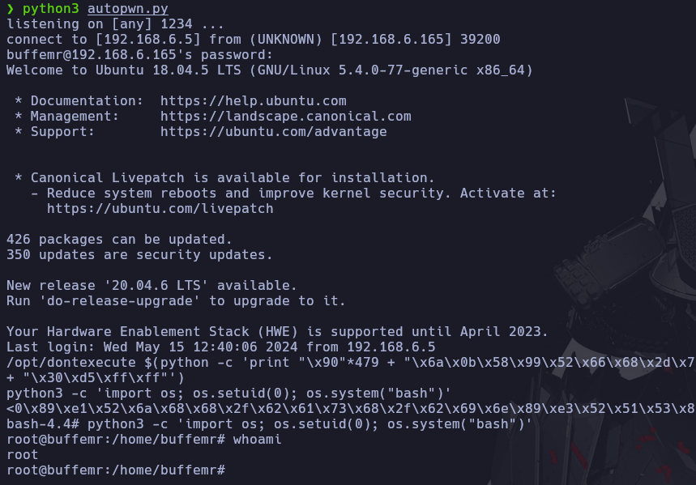

# Autopwn - BuffEMR

En caso de no haber realizado la máquina BuffEMR, es recomendable revisar el [writeup](http://mrpr1ngl3s.github.io/vulnhub/buffemr/ ) para comprender el autopwn.

<p align="center">
	
</p>

# Funcionamiento

```python


```

